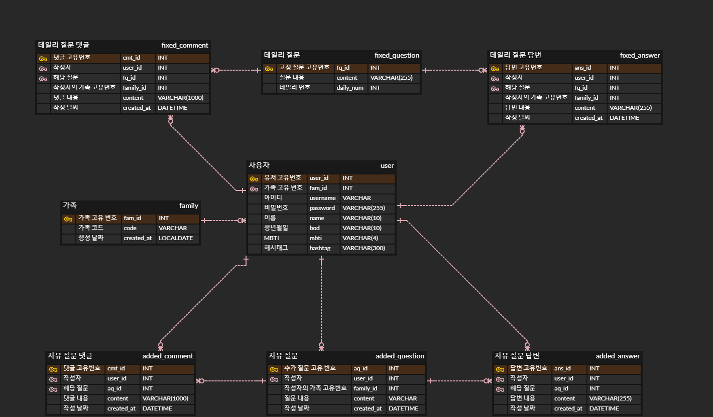
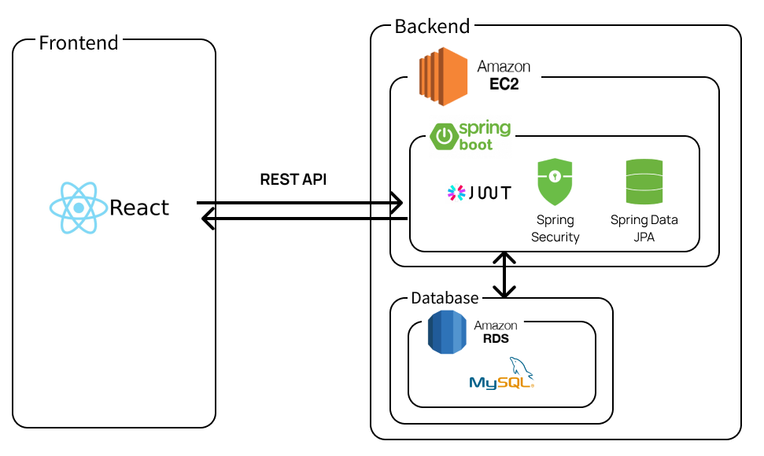
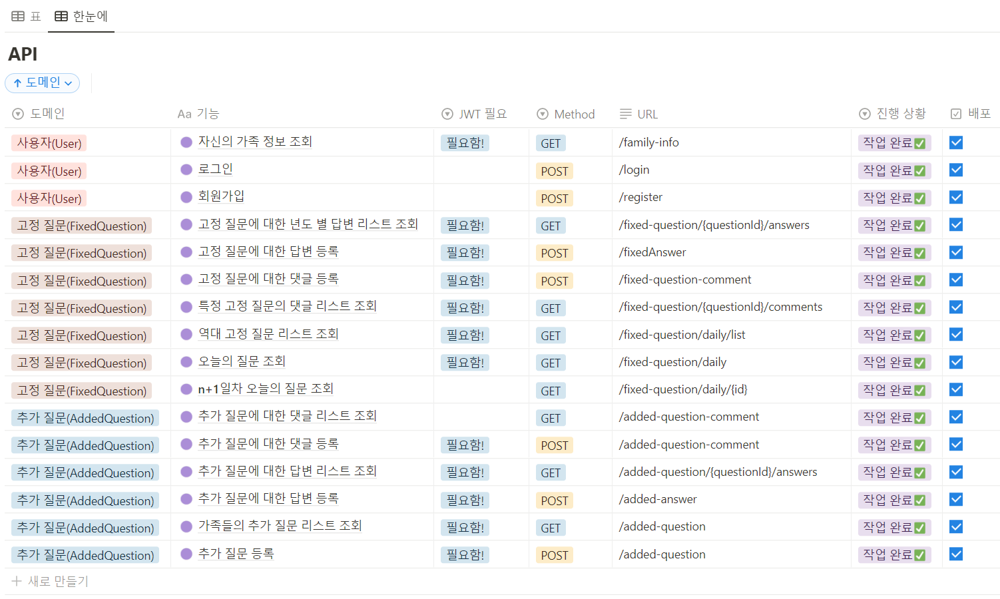

## Sonagi Backend 
COKOTHON - 소나기팀

 

## 🖥️ ️서비스 소개
**소나기, 소중한 나의 가족 기록**

 

## 🙋‍♀️ Info     
일정: 2022.12.28 WED 12:30 - 2022.12.29 THU 15:00   
BE: [김민지](https://github.com/kminji127), [김소은](https://github.com/soeunkk), [남윤찬](https://github.com/clzlol)   
FE: [김예지](https://github.com/rla-dPwl), [김혜은](https://github.com/hyeesw)

 

## 📌 ERD

 

## 🔍 System Architecture

 

## 📚 API Docs
[Notion](https://soeunkk.notion.site/API-Docs-75cc505b1c464cf2bc318e182b6c33b6)

 

## ⚙ 개발 환경
Java 11    
IDE: IntelliJ    
Framework: Spring Boot(2.x)    
Database: MySQL    
Build Tool: Gradle        

## Git Branch 전략
`main`: 배포 단위 branch    
`feat/기능`: 기능별 branch
