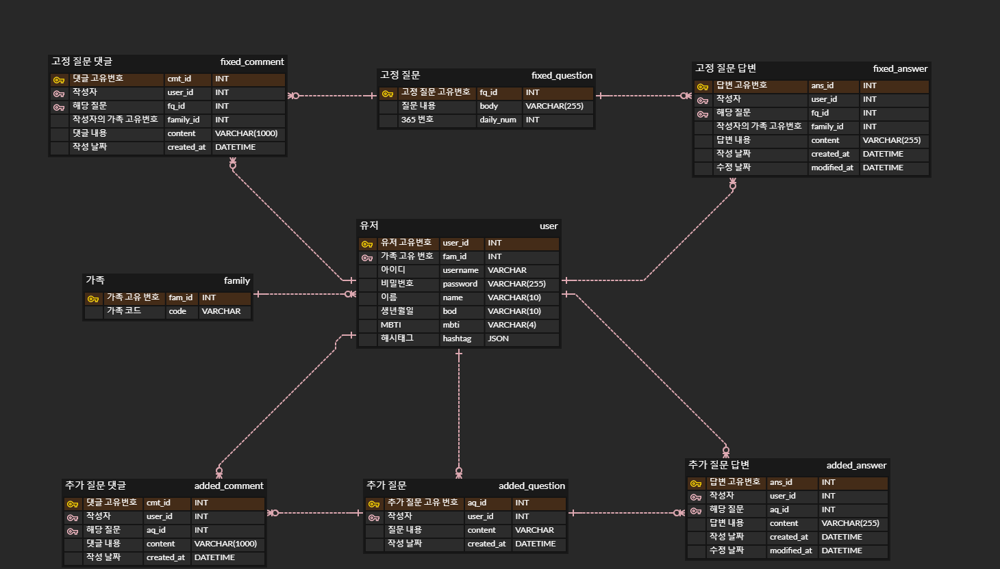

## Sonagi Backend 
COKOTHON - 소나기

### 
일정: 2022.12.28 WED 12:30 - 2022.12.29 THU 15:00   
BE: [김민지](https://github.com/kminji127)[김소은](https://github.com/soeunkk), [남윤찬](https://github.com/clzlol)   
FE: [김예지](https://github.com/rla-dPwl), [김혜은](https://github.com/hyeesw)

### ERD

### Technologies
SpringBoot, MySQL, Java 11    
AWS EC2    
Git     

### Git Branch 전략
`main`: 배포 단위 branch    
`feat/기능`: 기능별 branch
